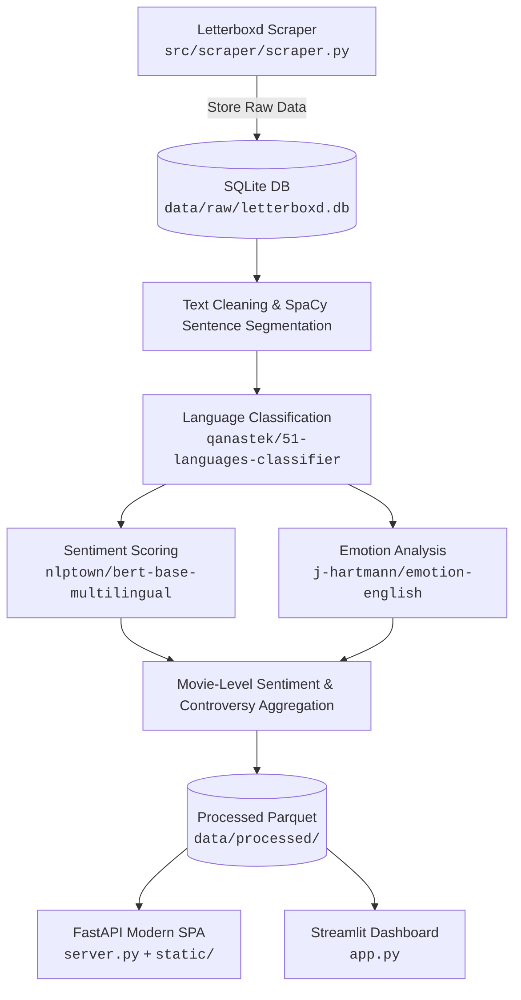

# PULSE: Letterboxd Sentiment & Emotion Profiling

**PULSE** is an end-to-end natural language processing pipeline and analytics platform designed to dissect, quantify, and visualize audience reception from movie reviews on [Letterboxd](https://letterboxd.com).

Rather than treating reviews as monolithic blocks or relying solely on a single aggregate star rating, PULSE decomposes over 175,000 reviews into individual sentences, tags their language across 51 linguistic families, computes sentence-level sentiment ratings via multilingual transformers, extracts 6-dimensional emotional profiles, and visualizes film-level controversy scores and audience consensus through interactive dashboards.

---

## Key Features

- **Automated Web Scraper & Relational Database**: Modular scraper (`urllib` + `BeautifulSoup`) collecting film metadata, cast, crew, details, genres, and paginated reviews into SQLite (`data/raw/letterboxd.db`).
- **Robust Text Preprocessing**: Strips markup, repairs mojibake via `ftfy`, removes emojis, normalizes unicode punctuation, and segments reviews into sentences using `spaCy`.
- **Language Identification**: Evaluates sentences using `qanastek/51-languages-classifier` to retain supported languages for downstream sentiment models.
- **Multilingual Sentiment Analysis**: Scores sentences on a 1-to-5 scale using `nlptown/bert-base-multilingual-uncased-sentiment`.
- **Emotional Signature Extraction**: Categorizes sentiments across 6 discrete emotions (joy, sadness, anger, fear, surprise, disgust) via `j-hartmann/emotion-english-distilroberta-base`.
- **Dual Pipeline Execution**:
  - **Dagster Orchestrator**: Asset-driven pipeline with materialization tracking, caching, and lineage.
  - **Sequential Jupyter Notebooks**: Step-by-step exploratory analysis and research notebooks (01 to 08).
- **Interactive Dashboards**:
  - **FastAPI + Modern Web UI**: Fast backend serving movie metrics, dynamic posters, Wikipedia synopses, and radar charts.
  - **Streamlit App**: Lightweight data discovery and filtering interface.

---

## Architecture & Data Flow



---

## Project Structure

```text
letterboxed_absa/
├── data/
│   ├── raw/
│   │   └── letterboxd.db          # Raw SQLite database (1,754 films, 175k reviews)
│   └── processed/                 # Generated Parquet datasets & summaries
├── docs/
│   ├── data_card.md               # Comprehensive schema & data provenance documentation
│   └── project_report.md          # In-depth technical and analytical report
├── notebooks/
│   ├── 01_data_overview.ipynb
│   ├── 02_demographics_distribution.ipynb
│   ├── 03_cast_crew_and_reviews.ipynb
│   ├── 04_absa_preprocessing_and_annotation.ipynb
│   ├── 05_language_classification.ipynb
│   ├── 06_sentiment_analysis.ipynb
│   ├── 07_movie_sentiment_aggregation.ipynb
│   └── 08_emotion_analysis.ipynb
├── src/
│   ├── database/
│   │   ├── __init__.py
│   │   ├── db.py                  # Schema definitions, table creation & upsert logic
│   │   └── check_db.py            # CLI database statistics inspector
│   ├── scraper/
│   │   ├── __init__.py
│   │   └── scraper.py             # Configurable letterboxd scraper with CLI
│   └── letterboxed_absa/
│       ├── __init__.py
│       ├── assets.py              # Dagster software-defined assets
│       └── definitions.py         # Dagster definitions entrypoint
├── static/                        # Frontend assets for FastAPI dashboard
│   ├── app.js
│   ├── index.html
│   └── style.css
├── app.py                         # Streamlit dashboard
├── server.py                      # FastAPI web server
├── pyproject.toml                 # Project metadata and dependencies
└── uv.lock                        # Reproducible dependency lockfile
```

---

## Installation & Setup

This project uses [`uv`](https://docs.astral.sh/uv/) for fast, deterministic Python environment management.

1. **Clone the repository**:
   ```bash
   git clone https://github.com/Dilharajay/PULSE.git
   cd PULSE
   ```

2. **Sync dependencies and initialize virtual environment**:
   ```bash
   uv sync
   ```

3. **Download the spaCy English model**:
   ```bash
   uv run python -m spacy download en_core_web_sm
   ```

---

## Usage Guide

### 1. Data Scraping & Inspection (Optional)

The repository already includes the raw dataset at `data/raw/letterboxd.db`. To scrape additional films or fresh reviews:

```bash
# Scrape popular films (default: data/raw/letterboxd.db)
uv run python src/scraper/scraper.py --pages 5 --reviews 100

# Scrape an individual film by Letterboxd slug
uv run python src/scraper/scraper.py --slug oppenheimer --reviews 50

# Custom request delay to adhere to rate limits
uv run python src/scraper/scraper.py --slug dune-part-two --delay 2.0

# Inspect database record counts
uv run python src/database/check_db.py
```

### 2. Orchestrated Pipeline (Dagster)

To launch the Dagster UI and materialize the data assets end-to-end:

```bash
uv run dagster dev -m src.letterboxed_absa
```

Open the web console at `http://localhost:3000` to view asset dependencies, execute materializations, and monitor pipeline progress.

### 3. Exploratory Analysis via Notebooks

To inspect individual steps or train/evaluate models interactively:

```bash
uv run jupyter notebook
```

Execute the notebooks in sequence:
- `01_data_overview.ipynb` / `02_demographics_distribution.ipynb` / `03_cast_crew_and_reviews.ipynb`: Exploratory Data Analysis (EDA).
- `04_absa_preprocessing_and_annotation.ipynb`: Text normalization & sentence extraction.
- `05_language_classification.ipynb`: Multilingual filtering.
- `06_sentiment_analysis.ipynb`: Sentence sentiment scoring.
- `07_movie_sentiment_aggregation.ipynb`: Aggregation, rating controversy calculation, and summary export.
- `08_emotion_analysis.ipynb`: Emotion distribution profiling.

### 4. Running the Dashboards

Once `data/processed/movie_sentiment_summary.parquet` is generated, you can launch either dashboard interface:

#### Option A: Modern FastAPI Dashboard (Recommended)
```bash
uv run uvicorn server:app --host 0.0.0.0 --port 8000
```
Navigate to `http://localhost:8000` to view the single-page application with dynamic film exploration, sentiment meters, and cached metadata.

#### Option B: Streamlit Dashboard
```bash
uv run streamlit run app.py
```

---

## Hardware Acceleration

Language classification and sentiment scoring leverage Hugging Face `pipeline` with GPU acceleration when CUDA is available. For high-volume sentence processing (400,000+ items), batch sizes can be customized in `assets.py` or within the corresponding notebooks according to available VRAM.
