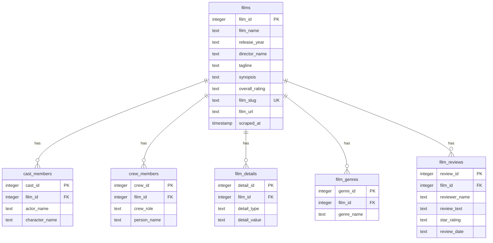

# Raw Data Card: Letterboxd Popular Films

This data card documents the raw SQLite database containing scraped data of popular films, cast, crew, details, genres, and reviews from [Letterboxd](https://letterboxd.com).

---

## 1. Dataset Overview

- **Source**: [Letterboxd Popular Films](https://letterboxd.com/films/popular/)
- **Database Format**: SQLite 3
- **File Name**: [letterboxd.db](file:///C:/Users/Dilhara%20Jayawardhana/Projects/Dev/DS-Projects/letterboxed_scrapper/data/raw/letterboxd.db)
- **File Size**: 58.48 MB (61,321,216 bytes)
- **Scraping Scope**: Up to 25 pages of popular films (72 films per page), capturing a maximum of 100 reviews per film.
- **Data Capture Window**: Compiled in June 2026.

---

## 2. Key Statistics

| Entity | Total Count | Unique Values | Key Findings / Highlights |
| :--- | :--- | :--- | :--- |
| **Films** | 1,754 | 1,754 (by slug) | Released between **1902 and 2026** (Min: *Le Voyage dans la Lune*, Max: latest 2026 releases) |
| **Cast Members** | 134,753 | 63,636 | Details all actors and their credited character roles |
| **Crew Members** | 123,539 | 50,289 | Details various roles (e.g., Director, Producer, Writer, Cinematographer) |
| **Film Details** | 11,818 | — | Includes studios, production countries, and release languages |
| **Genres** | 4,666 | 22 | Covers standard genres as well as highly specific thematic groupings |
| **Film Reviews** | 175,400 | — | Exactly **100 reviews per film**, capturing reviewer, rating, date, and text |

---

## 3. Database Schema

The database consists of 6 tables linked by standard foreign key relations to the primary `films` table:

### Table Details & Descriptions

#### 1. `films`
Stores metadata for the main film entries.
- `film_id` (*INTEGER PRIMARY KEY AUTOINCREMENT*): Unique internal identifier.
- `film_name` (*TEXT NOT NULL*): The name of the film.
- `release_year` (*TEXT*): The year the film was released (e.g., `'2014'`).
- `director_name` (*TEXT*): Primary director of the film.
- `tagline` (*TEXT*): Tagline/hook text shown on the film page.
- `synopsis` (*TEXT*): Narrative summary of the movie.
- `overall_rating` (*TEXT*): Aggregate Letterboxd rating (e.g., `'4.45'`).
- `film_slug` (*TEXT UNIQUE NOT NULL*): URL-friendly name used by Letterboxd (e.g., `'interstellar'`).
- `film_url` (*TEXT*): Full URL to the film's profile.
- `scraped_at` (*TIMESTAMP*): Date-time when the row was written (defaults to `CURRENT_TIMESTAMP`).

#### 2. `cast_members`
Stores the cast lists associated with each film.
- `cast_id` (*INTEGER PRIMARY KEY AUTOINCREMENT*)
- `film_id` (*INTEGER NOT NULL, FOREIGN KEY*): Links to `films(film_id)`.
- `actor_name` (*TEXT NOT NULL*): Name of the actor.
- `character_name` (*TEXT*): The name of the character played by the actor.

#### 3. `crew_members`
Stores the crew members and their roles.
- `crew_id` (*INTEGER PRIMARY KEY AUTOINCREMENT*)
- `film_id` (*INTEGER NOT NULL, FOREIGN KEY*): Links to `films(film_id)`.
- `crew_role` (*TEXT NOT NULL*): Role (e.g., `'Director'`, `'Writer'`, `'Producer'`, `'Cinematographer'`).
- `person_name` (*TEXT NOT NULL*): Name of the crew member.

#### 4. `film_details`
Attributes such as production studios, countries, and languages.
- `detail_id` (*INTEGER PRIMARY KEY AUTOINCREMENT*)
- `film_id` (*INTEGER NOT NULL, FOREIGN KEY*): Links to `films(film_id)`.
- `detail_type` (*TEXT NOT NULL*): The type of details stored (`'studio'`, `'country'`, or `'language'`).
- `detail_value` (*TEXT NOT NULL*): The actual value of the attribute.

#### 5. `film_genres`
Genres tagged on the movie.
- `genre_id` (*INTEGER PRIMARY KEY AUTOINCREMENT*)
- `film_id` (*INTEGER NOT NULL, FOREIGN KEY*): Links to `films(film_id)`.
- `genre_name` (*TEXT NOT NULL*): Name of the genre.

#### 6. `film_reviews`
Up to 100 user reviews for each film.
- `review_id` (*INTEGER PRIMARY KEY AUTOINCREMENT*)
- `film_id` (*INTEGER NOT NULL, FOREIGN KEY*): Links to `films(film_id)`.
- `reviewer_name` (*TEXT*): Username of the reviewer.
- `review_text` (*TEXT*): Full review body.
- `star_rating` (*TEXT*): Numerical star rating (1–5 scale, e.g., `'5'`, `'3.5'`).
- `review_date` (*TEXT*): Date the review was posted.

---

## 4. Demographic & Distribution Profiles

### Overall Rating Profile
- **Minimum Overall Rating**: 1.47
- **Maximum Overall Rating**: 4.68
- **Average Overall Rating**: 3.61

### Top Countries of Origin
A total of **49 unique countries** are represented in the dataset. The top 10 countries are:
1. **USA**: 1,509 films
2. **UK**: 269 films
3. **France**: 128 films
4. **Germany**: 78 films
5. **Japan**: 76 films
6. **Canada**: 57 films
7. **Australia**: 29 films
8. **Italy**: 28 films
9. **Spain**: 27 films
10. **Ireland**: 26 films

### Top Languages
A total of **76 unique languages** are represented. The top 10 languages are:
1. **English**: 2,178 occurrences
2. **French**: 234 occurrences
3. **Spanish**: 209 occurrences
4. **Japanese**: 137 occurrences
5. **German**: 112 occurrences
6. **Italian**: 107 occurrences
7. **Russian**: 80 occurrences
8. **Chinese**: 54 occurrences
9. **Latin**: 43 occurrences
10. **Korean**: 43 occurrences

### Genres
A total of **22 unique genres/categories** are represented. The top 10 genres are:
1. **Drama**: 772 films
2. **Comedy**: 576 films
3. **Adventure**: 390 films
4. **Thriller**: 374 films
5. **Action**: 372 films
6. **Science Fiction**: 313 films
7. **Horror**: 279 films
8. **Romance**: 275 films
9. **Fantasy**: 258 films
10. **Crime**: 247 films

*Full unique genre list:* Action, Adventure, Animation, Comedy, Crime, Documentary, Drama, Epic heroes, Explosive and action-packed heroes vs. villains, Family, Fantasy, History, Horror, Music, Mystery, Romance, Science Fiction, Superheroes in action-packed battles with villains, TV Movie, Thriller, War, Western.

---

## 5. Data Quality, Completeness & Formatting

- **Taglines**: 81 out of 1,754 films have a blank or `NULL` tagline (common for less publicized, documentary, or older films).
- **Synopsis**: 100% complete (0 blank/`NULL` entries).
- **Review Star Ratings**: 9,207 out of 175,400 reviews (~5.25%) do not contain a star rating (`NULL` in database). This represents user reviews written without assigning an explicit numeric score.
- **Review Text**: 4 out of 175,400 reviews have empty/`NULL` text (only a rating was logged by the user, but the parser registered it as a text review entry).
- **Temporal Consistency**: Release years are kept as text types to accommodate occasional non-standard year formatting on Letterboxd, but casting them to integers demonstrates movies spanning **1902** to **2026**.
